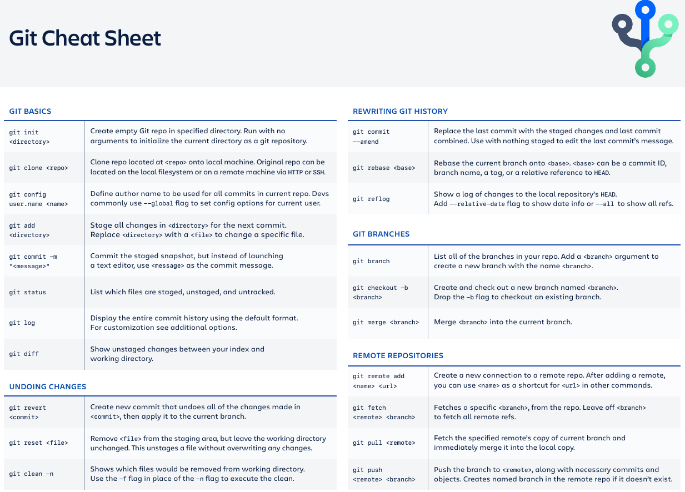

# Git

## Git Topics

1. Working Directory - Area where all of our files and directories are living all the time
2. Storing Area - Files and directories that we explicitly add to the storing area
3. Git Repository - Where all our snapshots are stored

## Git Cheat Sheet

<div align="center">
  
</div>

<div align="center">
  
</div>

## Git Basics

```
$ git init
$ git status
$ ls -a - shows files & directories including hidden
$ git add <file>
$ git add . - add all files & folders
$ git add *.js - add multiple files of a certain type
$ git reset <file> - undo a git add file befor commit
$ git checkout -- <file> - discard changes in working directory
$ git checkout -- . - discard all changes
$ git diff - show changes
$ git commit -m "message"
$ git commit -am "message" - commit modified files without add
$ git commit --amend --no-edit - Add files with last commit
```

- .gitignore - ignore files & folders

## Git Checkout

```
$ git log - shows git history
$ git checkout commit-id - changes to that commit
$ git revert --no-commit 0766c053..HEAD
```

## Git Branches

```
        Feature or New Branch
       /----0----0--0--0
      /                 \ merge
0----0----0----0---------0
master branch
```

```
$ git branch - listing all branches
$ git checkout -b branch_name - adding a branch
$ git checkout branch_name - changing branches
$ git merge branch_name
$ git branch -d branch_name - remove a branch
$ git branch -m <oldname> <newname> - rename
$ git branch -m <newname> - rename current branch name
```

## Git Remote

```
$ git remote -v - check the git remote version
$ git remote set-url origin <url>
```

## Cloning and Github Intro

- What is Github?
- clone github_url - Cloning an existing repo

## SSH KEY

### Checking for an existing SSH key

```
$ ls -al ~/.ssh
```

### Generating a new SSH key

```
$ ssh-keygen -t rsa -b 4096 -C "your_email@example.com"
```

### Adding the SSH key to the ssh-agent

```
# start the ssh-agent in the background
$ eval $(ssh-agent -s)

# add the ssh key to the ssh-agent
$ ssh-add ~/.ssh/id_rsa
```

### Adding a new SSH key to GitHub account

```
$ clip < ~/.ssh/id_rsa.pub
# Copies the contents of the id_rsa.pub file to your clipboard
```

### Testing SSH key connection

```
$ ssh -T git@github.com
```

### Custom configuration of ssh

```
$ code ~/.ssh/config
# open config file in VS Code

Then add this:
Host github.com
  Hostname ssh.github.com
  Port 443
```

## Pushing to Github

- Creating a repo on github
- Using ssh key, e.g. c9: git remote add origin git@github.com:foyezar/repo_name.git - Adding a remote
- Using laptop or destop: git remote add origin https://github.com/foyezar/repo_name.git - Adding a remote
- git remote -v - check remote connection
- git remote rm remote_name - remove a remote
- git push -u origin master - Pushing to github
